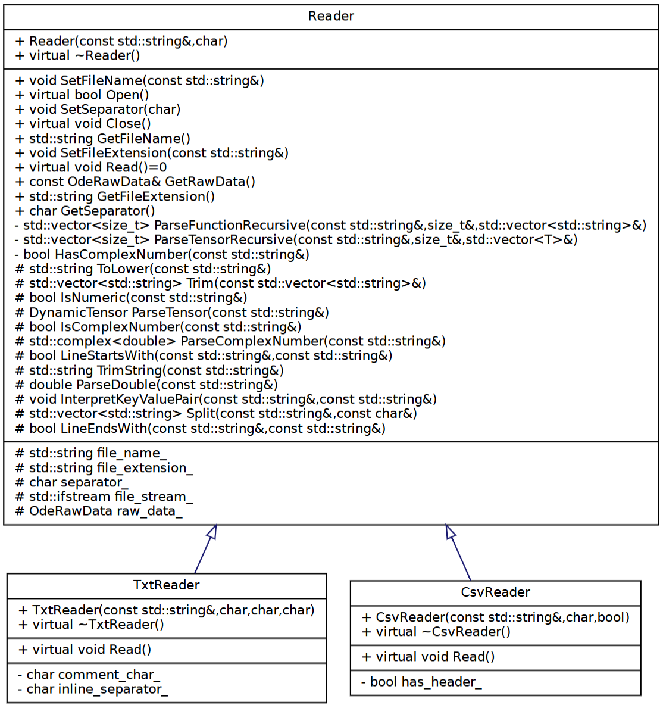
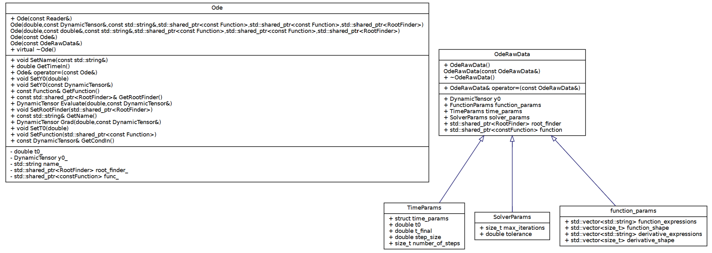
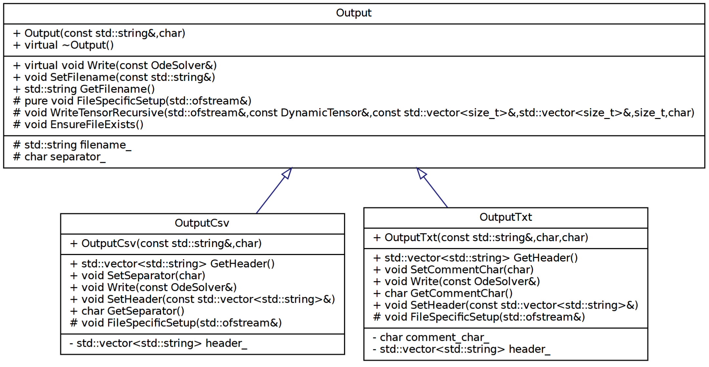

# <center> ODE Solver Project Report

## 1. Implementation Overview

This project implements a general solver for non-linear ordinary differential equations of the form:
$$
\frac{d\mathbf{y}}{dt} = \mathbf{f}(\mathbf{y},t)
$$
More importantly, the project allows the reading of a problem from a `text` or `csv` file, then provides six different methods to solve the problem numerically:
1. Euler Backward method
2. Euler Forward method
3. Order 4 Adams Bashforth method
4. Order 4 Runge Kutta method
5. Adams Moulton method
6. Newton Raphson method

Below we will provide an overview of the classes and how they can be used.

### 1.1 Handling inputs

### 1.1.1 Reader Classes

At the time of writing, the `Reader` class is the parent virtual class for all readers in the project. It defines the shared interface for reading input and converting it into an `OdeRawData` object, which is then used to construct an `Ode`. The current implementations are `ReaderTxt` for text files and `ReaderCsv` for csv files. Notice that in our conception, the reader is not a dumb reader: it is tasked with creating tensor or function objects as well. The limitations will come at the end. The class diagram is included below:


When reading from a file the format must follow a strict set of rules. Only key value pairs with recognised keys are processed. Each key expects a specific type of data, and incorrect or inconsistent data will cause the reader to throw an exception.

The accepted keys are listed below:

1. **`t`**  
   The initial time. Must be a real number. Parsed with `ParseDouble`.

2. **`tf`**  
   The final integration time. Must be a real number. Stored in `time_params.t_final`.

3. **`y`**  
   The initial condition. May be any tensor written in nested bracket form such as `[[1,2],[3,4]]`.  
   The parser deduces the shape and constructs a `DynamicTensor`.

4. **`step_size`**  
   The fixed step size for the solver. Must be a real number.

5. **`number_of_steps`**  
   An alternative to `step_size`. Specifies how many steps the solver should take. Must be an integer written as a real number.

6. **`tolerance`**  
   A real number that defines the tolerance used by adaptive or iterative methods. Stored in `solver_params.tolerance`.

7. **`max_iterations`**  
   A whole number written as a real that specifies the maximum number of iterations allowed in methods that require internal iteration.

8. **`function`**  
   Defines the right hand side of the system.  
   The value must be a nested tensor of expressions.  
   The parser extracts:
   - `function_expressions`  
   - `function_shape`  
   No function object is created at this stage. This function creation is delegated to the sub-classes because the function needs to be created with the derivatives, and at the moment of parsing, we do not know if derivatives are provided or not.

9. **`derivative`**  
    Defines the Jacobian of the system if supplied. It must be a tensor of expressions of the same shape expected for the derivative of the vector field.  
    The parser extracts:
    - `derivative_expressions`  
    - `derivative_shape`  
    Providing a derivative is optional, but advised when wanting to use implicit methods.

Any other keys are ignored at this stage, although support for additional parameters can be added later.

The only distinction between `.txt` and `.csv` readers is how they handle formatting:

- **Text files (`ReaderTxt`)**  
  May contain comments that begin with `#`.  
  May store all key value pairs on one line.  
  If values are in one line then an `inline_separator` must be provided. The character `,` should not be used for this since it is reserved for tensor entries.

- **CSV files (`ReaderCsv`)**  
  May contain a header.  
  The header is skipped only if the user sets `header = true` in the constructor.

Both reader types eventually call `InterpretKeyValuePair` to process each key and store the resulting data in `OdeRawData`.

Finally, the `ReaderCsv` and `ReaderTxt` create a `ParsedFunction` instance. This is not done in an optimal way, but it could not be done in a different way the given time constraints.

### Shortcomings of the readers

1. **CSV files are not used in a conventional way**  
   A typical comma separated file stores numerical data arranged in columns. In this project a CSV file is treated as a list of key value pairs instead, which does not follow the usual structure. As a result the use of CSV files here is somewhat unnatural and limited.

2. **The reader requires a very strict input format**  
   Every key must appear exactly as expected and every value must follow the required structure. While this ensures correctness it also makes the input files less flexible and less user friendly.

3. **Parsing responsibilities are not separated cleanly**  
   The current reader performs several tasks that should ideally belong to a dedicated parser. In particular the logic for interpreting tensors and function expressions could be delegated to a `Parser` class. This would keep the reader simple and allow the parsing code to evolve independently. This design improvement was realised too late in the project and there was not enough time to restructure the code accordingly.

4. **There is no consistency check between the function and its derivative**  
   When both the right hand side function and its derivative are provided, no verification is made to ensure that:  
   - the derivative tensor has the correct shape,  
   - the derivative expressions match the expected dimension of the function,  
   - or that the expressions are mathematically compatible.  
   This must be improved to avoid silent errors when the derivative is supplied incorrectly.

5. **Overuse of trimming**
   I think the trimming of whitespaces throughout the code is done very frequently, so that a string might be trimmed multiple times, which decreases performance. This should be decreased if possible.

### Running the Reader Unit Tests

The project uses CMake to configure and build all components, including the unit tests. The instructions below show how to configure the build directory and execute the tests.

#### On Windows (PowerShell or Command Prompt)

```bash
mkdir build
cd build
cmake -G "MinGW Makefiles" ..
mingw32-make
unittests
```

A test case running through a whole problem will be described in the end of the report.

---
### 1.1.2 The `OdeRawData` Structure

The `OdeRawData` structure acts as a container that stores all information extracted by the readers.  
It is not responsible for verification, consistency checks or object creation.  
Its purpose is simply to hold the raw user input in a structured format so that the `Ode` class can construct the actual mathematical object later. The class diagram is shown below:


An `OdeRawData` instance contains three groups of parameters:

1. **Time parameters**  
   These specify how the integration is to be carried out. They include:
   - `t0` the initial time  
   - `t_final` the final time  
   - `step_size` if fixed step integration is used  
   - `number_of_steps` as an alternative method to define the step size
   From here, only $t_0$ is passed into the Ode, the rest are only useful for the solver.

2. **Solver parameters**  
   These parameters configure the behaviour of solvers that require iterative or adaptive strategies. They include:
   - `tolerance` a real number that controls accuracy  
   - `max_iterations` the maximum number of internal iterations
   These will nnot be passed on to the the Ode, but can be passed into the solver.

3. **Function parameters**  
   These define the right hand side of the ordinary differential equation and optionally its derivative. They include:
   - `function_expressions` a flattened list of expressions  
   - `function_shape` the shape of the right hand side tensor  
   - `derivative_expressions` the Jacobian expressions if supplied  
   - `derivative_shape` the shape of the Jacobian  
   These are used to create the instance of a parsed function, and only serve as a storage for when the reader has not yet constructed the function.

Finally, `OdeRawData` contains the initial condition:

- `y0` a `DynamicTensor` that represents the initial state of the system
- `func_` which is a shared constant pointer to a function instance, created from the function parameters.

All fields in `OdeRawData` are written exactly once by the reader and are then consumed by the `Ode` constructor. The structure remains passive and does not attempt to interpret or validate the contents.

---
### 1.1.3 The `Ode` Class

The `Ode` class represents the full definition of an ordinary differential equation problem. It is constructed either directly from numerical values or from data read by a reader. Its main role is to gather all components required to describe the initial value problem. Thereofre, it does not save the numerical parameters required to solve it. An `Ode` has as attributes:
1. the initial time `t0`  
2. the initial condition `y0` as a `DynamicTensor`  
3. a name used to identify the system  
4. a pointer to a `Function` object that represents the right hand side  
5. an optional derivative function, supplied indirectly through the `Function` interface  
6. an optional `RootFinder` for implicit solvers.

See the class diagram above.

An `Ode` can be created by:
- constructing directly from numerical values and a `Function`  
- constructing from scalar initial conditions, which are promoted to a rank one tensor  
- constructing from a `Reader`  
- constructing from an `OdeRawData` structure  
- copying from another `Ode`

An `Ode` holds a pointer to a function (const, so that it cannot be modified) and we can evaluate said function through the `Evaluate` method. This forwards the request directly to this function and returns its value as a `DynamicTensor`. The `Ode` also provides access to the gradient of the function through the `Grad` method.

The `Ode` class verifies the size of its function and the validity of the initial condition (if one of them is changed through a getter or setter) by calling upon the evaluate method of the function and passing the initial condition as parameter. This assumes the evaluate method of the function internally checks the validity of the argument. No check is done on the validity of the derivatives. Another shortcoming of the class is that we do not use the `RootFinder` for anyhting in the ode class, and the name of the `Ode` is also redundant for the time being.

### Running the Ode Unit Tests
The unittests can be run in the exact same way as the reader tests. In fact, all future tests are ran by those commands.

---
### 1.1.4 The `Function` Class

The `Function` class defines the abstract interface for representing any function. Here, it is used to represent the right hand side of an ordinary differential equation. The class diagram is shown below:

It models a mapping of the form

$$
    f : (t, y) \longmapsto \frac{\mathrm{d}y}{\mathrm{d}t},
$$

where `y` is a `DynamicTensor` of arbitrary shape. Solvers interact only with this interface and remain unaware of the internal implementation of the function. A user can define any of their own functions that they want to test, simply by overloading the `Eval` method.

The class has two main methods

1. **Evaluating the function**

   Every concrete subclass must implement  
   ```cpp
   virtual DynamicTensor Eval(double t, const DynamicTensor& y) const = 0;
   ```
   This method evaluates the function at time $t$ and at $y$. The output tensor must be compatible in shape with the state tensor used by the Ode, but this check is not made by the function.

2. **Computing the gradient**
   
   The class provides a default implementation of
   ```cpp
   DynamicTensor Grad(double t, const DynamicTensor& y, double dy = 0.1) const;
   ```
   which computes the gradient using a central finite difference scheme. This enables implicit solvers to approximate Jacobians even when no analytical derivative is supplied. Subclasses may override this method to provide an exact gradient.

### Shortcomings of the Function class
Right now, there is no checking mechanism provided for veryfying the shape of the function and the input tensor. This responsibility is delegated to the user to verify for the time being.
---
### The ParsedFunction Class

The ParsedFunction class is a concrete implementation of the Function interface. It uses the `muParserX` external library to interpret mathematical expressions written as strings. This allows users to define ordinary differential equations entirely in input files without writing C++ code.

A `ParsedFunction` object is created from:
 - A list of expressions desribing the right hand side (one dimensional).
 - The shape of the output tensor (row-major).
 - An optional list of derivative and
 - their corresponding shape (if provided).

This structure supports both scalar and tensor valued ODE systems. The responsibilities of the class are as follows.

The right hand side expressions are stored in `expressions_` together with their shape in `function_shape_`. If analytical derivatives are supplied, they are stored in `derivatives_` and `derivative_shape_`. These strings remain unchanged after construction and are evaluated at runtime whenever the solver requests a function value. The `Eval` method parses and evaluates each expression using muParserX. The variables `t` and the components of the tensor `y` are injected into the parser. The method returns a DynamicTensor whose shape matches the one supplied at construction. Internally the evaluation is performed by the helper method Compute, which rebuilds the output tensor from the flattened list of computed values. The shape is verified for this method.

Similarly, we provide a method to calculate the gradient at a point, provided that the derivatives are also given (with their size). In this case, the class overrides the gradient method so that
```cpp
DynamicTensor Grad(double t, const DynamicTensor& y) const
```
returns the exact analytical Jacobian. The derivative expressions are evaluated using the same mechanism as the main function. If no derivative expressions are given, the class falls back to the finite difference method inherited from the base class `Function`. The shape of the derivatives is not checked right now.

---
### 1.1.5 The `Output` Class

The `Output` class is the abstract parent class to output a solution produced by an `OdeSolver`. Currently, it only has two subclasses, `OutputTxt` and `OutputCsv`, therefore the parent class is more like a file output class. This structure allows us to keep the solver independent of any output format, while still enabling writing the result in a desired way. The output class diagram is shown below


The idea is that once the solver has finished its computation, an output object receives the final time and the corresponding solution values and writes them to a file using a chosen format.

The `Output` class defines the common behaviour for all output formats. The constructor takes the file name and an optional separator and ensures that the file can be created. The public methods are:

- `Write(const OdeSolver& solver)` which now contains the shared logic for writing numerical solver data  
- `GetFilename()` and `SetFilename()` for file name access

The difference between the parent class and its subclasses is expressed through the virtual method  `FileSpecificSetup(std::ofstream& file)`. Each subclass overrides this method to insert its own header or format specific preamble, while the general writing process (final time, step size, number of steps, tensor output) is handled inside the parent `Write` method. This avoids repeating identical code in `OutputTxt` and `OutputCsv`. Other helping functions are:

- `EnsureFileExists()` which creates the file if required  
- `WriteTensorRecursive(...)` which writes a `DynamicTensor` to the file in the same way that we read them and prints complex numbers in the form `(real, imag)`.

The distinction between `.txt` and `.csv` writers is then limited to formatting:

- **`OutputTxt`** writes results in a plain text format. It includes a comment character `comment_char_` and a list of header lines `header_`. Its setup method writes each header line as a comment and the main write routine adds the key value pairs such as the final time `t`, the tensor `y`, and details like the step size.

- **`OutputCsv`** writes in the same way but uses a single header row rather than comment lines.

### Shortcomings

This class was created quickly and does not yet print all useful data. Ideally, it would output all necessary information so that the simulation could be reconstructed entirely from the file. Additional output styles, such as plotting or allowing the printing of solutions at different points, would also be good extensions. 

## Abstract Base Classes for Solvers

### OdeSolver

The `OdeSolver` class represents the abstract base class for numerically integrating Ordinary Differential Equations of the form $\frac{dy}{dt} = f(t, y)$, where the state $y$ is represented by a `DynamicTensor`. Implementations such as Forward Euler or Runge-Kutta must inherit from this class and implement the pure virtual `ComputeStep()` method specific to that method.

The class offers initialization via two constructors:
- **Fixed Step Size:** Constructs the solver using the `Ode` reference, a specific step size (`step_size`) and the `end_time`.
- **Fixed Step Count:** Constructs the solver using the `Ode` reference, total number of iterations (`num_of_steps`) and the `end_time` (automatically calculates the step size).

Once constructed, an `OdeSolver` manages the simulation state by storing a constant reference to the problem as `ode_`, `start_time_`, `end_time_` and `step_size_`, the current state tensor as `solution_` and the current timestamp as `current_time_`.

The class provides three important methods to control the simulation:
- **`Reset()`**: Reverts the solution and current time to the initial conditions defined in the ODE.
- **`Step()`**: Advances the simulation by a single increment. It invokes `ComputeStep()` to calculate the new state, then updates `solution_` and advances `current_time_`. This method can be placed inside a custom loop for scenarios where the number of steps is dynamic or unknown.
- **`Solve()`**: Automates the execution of the simulation from start time to end time. It repeatedly calls `Step()` until `end_time_` is reached.

### MultiStepOdeSolver

The `MultiStepOdeSolver` class inherits from `OdeSolver` and serves as an abstract base for methods that utilize historical data to approximate the solution. These methods generalize the integration process using the following linear multistep relationship:

$$c^y_0 y_{n+1} - h c^{dy}_0 f(t_{n+1}, y_{n+1}) = \sum_{i=1}^{k} c^y_i y_{n+1-i} + h \sum_{i=1}^{k} c^{dy}_i f(t_{n+1-i}, y_{n+1-i})$$

Where:
- $h$ is the time step (`step_size_`).
- $c^y$ and $c^{dy}$ are method-specific coefficients.
- The Right Hand Side (RHS) represents the weighted sum of previous states and derivatives (`sum_tn_`)

In this design, defining a specific solver reduces to simply defining the vectors of coefficients $c^y$ and $c^{dy}$.

Following are the important details of the class:
- **order_solution**: The number of past solution states ($y$) to retain.
- **order_derivative**: The number of past derivative evaluations ($dy/dt$) to retain.
- **State Management:** The class maintains `solutions_buffer_` and `derivative_buffer_` using `std::deque` for `O(1)` push and pop operations to store the previous $y$ and $f(t,y)$ values required by the order of the method.
- **Rhs Computation:** The class calculates and caches the variable `sum_tn_`, which represents the entire Right Hand Side of the equation above.
- **Explicit Solver Support:** For explicit methods (where $c^{dy}_0 = 0$), the equation simplifies such that the next step $y_{n+1}$ is derived directly from the computed `sum_tn_`.

Constructors & Methods:
The constructors extend the base `OdeSolver` to accept `order_solution` and `order_derivative` determining the size of the buffers for solutions and derivatives.
- **`Reset()`**: Clears the buffers and re-initializes the state.
- **`Step()`**: Advances the simulation. It computes `sum_tn_`, updates the buffers with the new result, and manages the sliding window of history.
- **`GetCoeffsY()` / `GetCoeffsdY()`**: Pure virtual methods that derived classes must implement to provide the specific coefficients for the algorithm.
- **`InitBuffers()`**: Initializes the buffers for solutions and derivatives using runge kutta method which can be overriden in any derived classes.

### ImplicitSolver

The `ImplicitSolver` class extends `MultiStepOdeSolver` to handle **implicit** methods. Unlike explicit methods, implicit methods feature a non-zero coefficient for the current derivative term $c^{dy}\_0 \neq 0$. This means the next state $y_{n+1}$ appears on both sides of the equation making direct substitution impossible.

To determine the next step, the solver treats the update rule as a root-finding problem:

$$F( y_{n+1} ) = c^y_0 y_{n+1} - h c^{dy}\_0 f(t_{n+1}, y_{n+1}) - \mathrm{sum\_tn\_} = 0$$

where `sum_tn_` corresponds to the cached window sum calculated by the `MultiStepOdeSolver` class.

Following are the details of the class:
- **Root Finding Method:** The class has an optional pointer `std::shared_ptr<RootFinder>` during construction. This component is responsible for numerically solving the equation above at every time step. The default RootFinder is Newton-Raphson method.
- **`ImplicitEquation` Helper:** A protected inner class that generates the implicit equation into a `Function` interface which is then used by the `RootFinder` to find the next solution.
- **`ComputeStep()` Implementation:** Constructs the specific `ImplicitEquation` for the current time step and finds the solution of $y_{n+1}$ to the `root_finder_`.

## Implicit Methods

### Bdf (Backward Differentiation Formula)

The `Bdf` class implements the **Backward Differentiation Formula** integration method by inheriting from `ImplicitSolver` and the update rule can be stated as:

$$ \sum_{j=0}^{k} c^y_j y_{n+1-j} = h c^{dy}\_0 f(t_{n+1}, y_{n+1}) $$

. BDF does not rely on the history of derivative values. Instead, it approximates the derivative using only the current and previous solution states. Consequently, the constructor initializes the base `ImplicitSolver` with `order_derivative = 0`, ensuring that the history term (`sum_tn_`) consists solely of past $y$ values.

Following are the important details of the class:
- **Orders:** The class supports orders 1 through 4.
- **Coefficients:** The class implements `GetCoeffsY()` and `GetCoeffsdY()` to provide the standard BDF coefficients. For a given order $k$, the update rule follows the form:
  
  $$y_{n+1} - h \beta_0 f(t_{n+1}, y_{n+1}) = \sum_{i=1}^{k} \alpha_i y_{n+1-i}$$

  Where $\beta_0$ corresponds to the single coefficient returned by `GetCoeffsdY()` and the $\alpha_i$ values correspond to the vector returned by `GetCoeffsY()` (excluding the first element $c^y_0=1$).

Constructors:
The constructors accept an integer `order` (validated to be between 1 and 4). If an invalid order is provided, an `std::invalid_argument` exception is thrown.

### BackwardEuler

The `BackwardEuler` class is a derived class of `Bdf` that implements the **first-order Backward Differentiation Formula**.

The class constructors simplify initialization by automatically setting `order = 1`, reducing the generic BDF update rule to the classic Backward Euler form:

$$y_{n+1} = y_n + h f(t_{n+1}, y_{n+1})$$

### AdamMoulton

The `AdamMoulton` class implements the **Adams-Moulton family** of implicit linear multistep methods. It inherits from `ImplicitSolver`.

Adams-Moulton methods rely on the history of derivatives.

The general update rule implemented is:
$$y_{n+1} = y_n + h \sum_{j=0}^{k} c^{dy}\_0 f(t_{n+1-j}, y_{n+1-j})$$

In the context of the `MultiStepOdeSolver` class:
- **`GetCoeffsY()`**: Returns coefficients representing the LHS $(y_{n+1} - y_n)$, usually $[1.0, -1.0]$.
- **`GetCoeffsdY()`**: Returns the specific coefficients for the method order

**Constructors:**
- Accepts an `order` (typically 1 to 4).

## Explicit Methods

### AdamsBashforth

The `AdamsBashforth` class implements the **Adams-Bashforth family** of explicit linear multistep methods. It inherits directly from `MultiStepOdeSolver`.

The general update rule implemented is:
$$y_{n+1} = y_n + h \sum_{j=1}^{k} c^{dy}\_0 f(t_{n+1-j}, y_{n+1-j})$$

In the context of the `MultiStepOdeSolver` class:
- **Explicit formulation:** The coefficient for the current derivative ($c^{dy}_0$) is 0.
- **`ComputeStep()`**: Since the next state is explicitly defined by history, this method simply retrieves the cached history sum (`sum_tn_`) calculated by the base class and returns it as the new state.
- **`GetCoeffsY()`**: Returns the coefficients representing the LHS (typically just $y_{n+1} - y_n$).
- **`GetCoeffsdY()`**: Returns the specific $\beta$ coefficients corresponding to the method's order (e.g., weights for previous slopes).

**Constructors:**
- **Fixed Step Size:** Constructs the solver with a specific `step_size` and `order` (typically 1 to 4).
- **Fixed Step Count:** Constructs the solver with a specific `num_of_steps` and `order`.

### ForwardEuler

The `ForwardEuler` class is a implementation of the **Forward Euler** method. It serves as a derived class for the `AdamsBashforth` class by setting the integration order to 1.
As the simplest explicit method, it computes the next state $y_{n+1}$ using only the current gradient information.

The update rule is the first-order explicit formula:
$$y_{n+1} = y_n + h f(t_n, y_n)$$

Constructors:
- **Fixed Step Size:** Constructs the solver with a specific `step_size`.
- **Fixed Step Count:** Constructs the solver with a specific `num_of_steps`.
Here is the description for the `ForwardEulerLight` class.

### ForwardEulerLight

The `ForwardEulerLight` class is a lightweight, standalone implementation of the **Forward Euler** method. Unlike the standard `ForwardEuler` class which derives from the `AdamsBashforth` logic this class inherits directly from `OdeSolver`.
The direct implementation avoids the overhead of managing history buffers `std::deque` and coefficient vectors. It is designed for fast performance on simple problems.

The class implements the standard explicit update rule in `ComputeStep()`:
$$y_{n+1} = y_n + h f(t_n, y_n)$$

Constructors:
- **Fixed Step Size:** Constructs the solver with a specific `step_size`.
- **Fixed Step Count:** Constructs the solver with a specific `num_of_steps`.

### RungeKutta

The `RungeKutta` class implements the classical **4th-order Runge-Kutta (RK4)** integration scheme. It inherits directly from `OdeSolver`. Unlike the multistep methods , RK4 is a single-step but multi-stage method. It does not rely on a history buffer of previous states. Instead, it computes four intermediate slope estimates within the current time interval to achieve significantly higher accuracy than Forward Euler.

The `ComputeStep()` method calculates the next state using the weighted average of these slopes:

$$y_{n+1} = y_n + \frac{h}{6}(k_1 + 2k_2 + 2k_3 + k_4)$$

Where:
- $k_1 = f(t_n, y_n)$
- $k_2 = f(t_n + \frac{h}{2}, y_n + \frac{h}{2}k_1)$
- $k_3 = f(t_n + \frac{h}{2}, y_n + \frac{h}{2}k_2)$
- $k_4 = f(t_n + h, y_n + h k_3)$

Constructors:
- **Fixed Step Size:** Constructs the solver with a specific `step_size`.
- **Fixed Step Count:** Constructs the solver with a specific `num_of_steps`.

## Utilities

### RootFinder

The `RootFinder` class is an abstract base class that defines the interface for numerical root-finding algorithms. It is a critical dependency for all implicit ODE solvers which needs to solve non-linear equations at every time step.
- **Polymorphic:** Allows the ODE solver to be decoupled from the specific numerical method used to solve the implicit equation.
- **`FindRoot()` Method:** The pure virtual function that performs the rootfinding. It takes a generic `Function` object (wrapper around the equation $g(y) = 0$), an `initial_guess`, and the current time $t$.
- **Tensor:** Designed for any rank using the `DynamicTensor` object.

### NewtonRaphson

The `NewtonRaphson` class is a implementation of the `RootFinder` interface. It solves for the root of a non-linear function using the iterative Newton-Raphson method. The `FindRoot` method executes a fixed number of iterations defined by `max_iter`. At each step, it updates the solution estimate using the gradient information provided by the `Function` object:

$$y_{new} = y_{old} - \frac{f(t, y_{old})}{f'(t, y_{old})}$$

Shortcomings:

 1. The current implementation of Newton Raphson root finder is exclusively for 0D tensors.

### DynamicTensor

The `DynamicTensor` class is the core data structure used throughout the library to any tensors. It is designed to be flexible, supporting **runtime definition of dimensions** and accommodating both Real (`double`) and Complex (`std::complex<double>`) data types. We developed `DynamicTensor` to address the gap of Eigen:
1.  **Dynamic Rank:** Unlike Eigen, which requires compile-time tensor ranks, this class supports tensors where both the shape and the rank are determined at runtime.
2.  **Avoidance of Templates:** We chose to use the container `std::variant` that allows Runtime Polymorphism rather than making the class a template. This prevents the need for a "header-only" library, allowing us to cleanly separate implementations into `.h` and `.cpp` files. This improves code organization and project compilation structure.

Some key details of the class:

  * **Rank & Shape:** Can represent scalars, vectors, matrices or N-dimensional arrays.
  * **Real and Complex:** It uses `std::variant` to store either a `std::vector<double>` or `std::vector<std::complex<double>>`. The type is fixed at construction.
  * **Arithmetic Operations:** It uses operator overloading for element-wise addition, subtraction, multiplication and division as well as scalar broadcasting
  * **Memory Layout:** Stores data in a contiguous 1D memory block using std::vector.

Constructors:

  * **Shape Constructor:** Initializes a tensor of zeros (or a specific value) given a shape vector (e.g., `{2, 3}`).
  * **Data Constructor:** Wraps an existing `std::vector` of data into a tensor with a specified shape.
  * **Scalar Constructor:** Creates a rank-0 tensor from a single `double` or `Complex` value.

**Example Usage:**

```cpp
// Create a 2x3 Real matrix filled with 1.0
std::vector<size_t> shape = {2, 3};
DynamicTensor t(shape, 1.0); 

// Access element at row 0, col 1
t.at<double>({0, 1}) = 5.0; 

// Element-wise multiplication with a scalar
DynamicTensor t2 = t * 2.0; 
```
Shortcomings:

1. The current implementation has very limited operator overloading and so is rigid in terms of the syntax that can be used for tensor manipulation.
2. Current implementation completely separates Complex types from Real types and does not allow for using mixed types.

### REMAINING TO DO main.

# For executing only the Doxyfile
```bash
cd docs
doxygen
```

# For compiling and generating the Doxygen documentation
```bash
mkdir build
cd build
cmake ..
make
```
---
## Distribution of Work
The project was done by Ahmed Rockey Saikia and Andras Horkay. Andras worked on the classes and the corresponding unittests on `Ode`, `OdeRawData`, `Reader`, `ParsedFunction`, `ReaderCsv`, `ReaderTxt` and `Output` . Rockey worked on `Ode`, `OdeSolver`,`MultiStepOdeSolver`, `ImplicitSolver` `DynamicTensor` graphical `Output` and `Function`. The conception and design of the project was decided by the both of us, only the coding was done separately. Below are some notes from the authors.

- Notes from Andras: I have used LLMs when commenting and debugging my code. I have used it especially a lot when developing the reader class, so that I can parse the tensors and and fucntions properly. The design of how these are read were my idea, but I needed help when doing the `Recursive` functions when parsing: `ParseFunctionRecursive` and `ParseTensor`. After this, I did feed most of my code also to ChatGPT to see if there are any improvements to be done, but it did not suggest many improvements. I have also used LLMs to generate some of the unittests. I have left comments where changes were code was made by LLMs.
- Notes from Rockey: I have used LLMs for commenting my codes. For the creationg of the DynamicTensor class, I sought help from LLMs for using `std::variant` technique to store both complex and real numbers without templating. I have also used LLMs to refine some part of the report where I use it primarily for paraphrasing.
